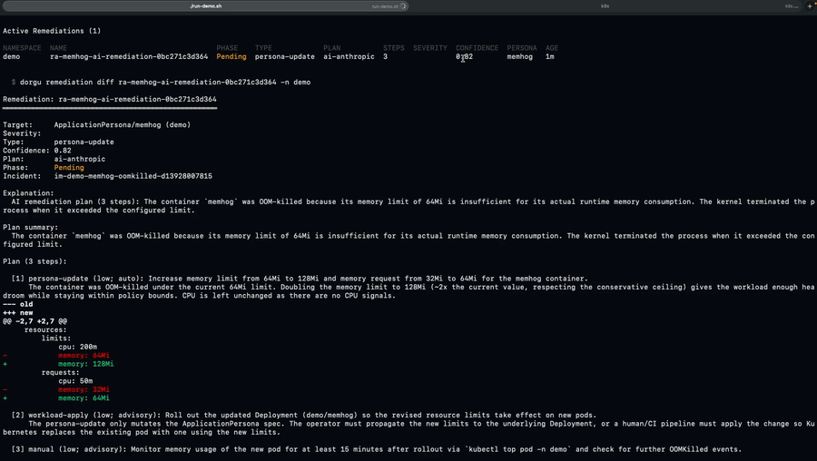
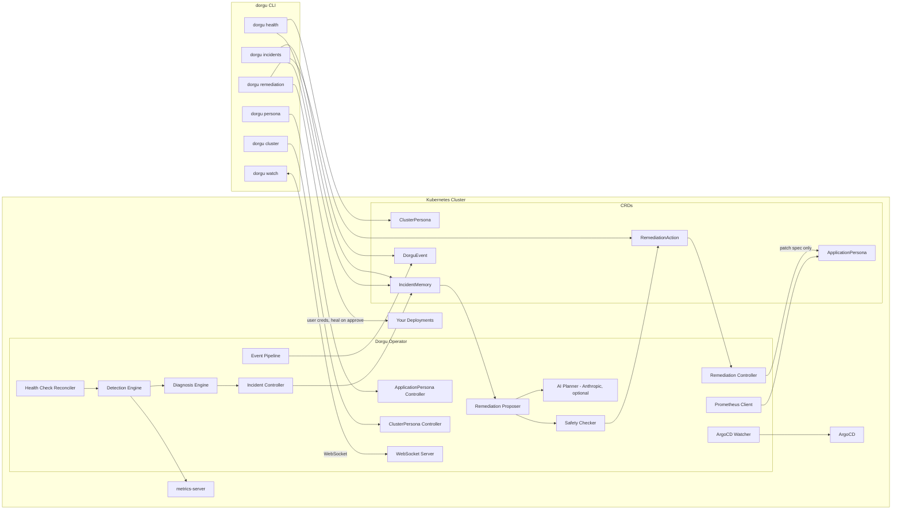

# Dorgu Operator

**The cluster-side half of [Dorgu](https://github.com/dorgu-ai/dorgu) — the open-source AI SRE for Kubernetes.** The operator watches your cluster, detects what's wrong, diagnoses the root cause, and proposes a reviewable fix. You approve it with the CLI, and the loop closes: apply, verify, roll back if health regresses, remember for next time.

[](https://go.dev/)
[](LICENSE)

<p align="center">
  
</p>

<p align="center">
  <a href="https://youtu.be/lB_529ydWw4"><strong>▶ Watch the 3-minute demo</strong></a>
</p>

---

## The self-healing loop

```
detect  →  diagnose  →  propose  →  approve  →  heal  →  verify  →  remember
  │           │            │           │          │        │           │
operator    operator     operator     you       CLI     operator   IncidentMemory
(signals)  (rules +     (Remediation  (dorgu   (your     (health    (root cause +
           optional      Action with   remedi-  creds,    check,     outcome, for
           Anthropic)    ordered       ation    patches   auto-      next time)
                         Steps[])      approve) workload) rollback)
```

1. **Detect** — the health check reconciler runs every 60 seconds and gathers signals: node conditions, pod failures (OOMKilled, CrashLoopBackOff, ImagePullBackOff), resource saturation, control plane component health, and optionally container-level usage from metrics-server.
2. **Diagnose** — deterministic rules produce a root cause with a confidence score (0.0–1.0). With an Anthropic key configured, AI enhances the diagnosis. An **IncidentMemory** CRD records it.
3. **Propose** — the remediation proposer emits a **RemediationAction**: an explanation, a pre-patch snapshot, a JSON merge patch against a Persona spec, and — with `aiRemediation.enabled` — an ordered `Steps[]` plan from the AI planner. Deterministic rules remain the floor; AI never replaces them.
4. **Approve** — the action sits in `Pending`. Nothing happens until a human runs `dorgu remediation approve`.
5. **Heal** — the **CLI** applies the equivalent change to the running workload, using the user's own credentials. The operator does not do this. See the invariant below.
6. **Verify** — the operator re-checks health. If it degraded, the pre-patch snapshot is reapplied and the action moves to `RolledBack`.
7. **Remember** — the outcome lands back on the IncidentMemory, so recurrence and resolution history accumulate in the cluster.

### The invariant

> **The operator never creates or modifies Deployments, Services, or any other workload resource.** It reads cluster state, writes Persona CRD spec and status, emits events, and proposes fixes. That's the whole surface.

This is structural, not a setting. A remediation patches `ApplicationPersona.spec` — the *desired* state. The running workload is changed by `dorgu remediation approve`, which runs on the user's machine with the user's credentials. ArgoCD, Flux, and `kubectl` stay in charge of deployment.

The same principle governs plan steps: only **`persona-update`** steps may be `AutoExecutable`. This is enforced by a CEL validation rule on the CRD *and* by `ValidateAutoExecutable()` in the API package. Every other step type (`workload-apply`, `restart`, `scale`, `config-change`, `manual`, `notification`, `git-pr`) is advisory — surfaced as an ordered instruction, never executed by the operator.

---

## AI planner (Anthropic, BYO key, optional)

AI is **entirely optional**. With no key, detection and diagnosis are fully deterministic and the proposer uses the rule-based path. With a key:

- **AI-enhanced diagnosis** — richer root-cause narrative on IncidentMemory.
- **AI remediation planning** — the planner produces an **ordered `Steps[]` plan** on the RemediationAction, each step with a type, order, description, reason, and (for `persona-update`) a patch. This is what you read in `dorgu remediation diff`.

Anthropic (Claude) is the only provider wired for v1. The key is injected as the `ANTHROPIC_API_KEY` env var from a Kubernetes Secret — **never** as an inline pod-spec arg, so it does not leak into `kubectl get pod -o yaml` or `helm get values`.

### Setup

**Never commit a real key.** Create the Secret out-of-band and reference it — the key never touches Helm values:

```bash
kubectl create namespace dorgu-system
kubectl create secret generic dorgu-llm \
  --from-literal=ANTHROPIC_API_KEY=sk-ant-... \
  -n dorgu-system
```

Then install with AI enabled:

```bash
helm install dorgu-operator oci://ghcr.io/dorgu-ai/dorgu-operator-charts/dorgu-operator \
  --namespace dorgu-system \
  --create-namespace \
  --set healthCheck.enabled=true \
  --set websocket.enabled=true \
  --set llm.provider=claude \
  --set llm.existingSecret=dorgu-llm \
  --set aiRemediation.enabled=true
```

Or via a values file:

```yaml
# values-local.yaml  (gitignored — copy from charts/dorgu-operator/values-local.example.yaml)
healthCheck:
  enabled: true
llm:
  provider: claude
  existingSecret: dorgu-llm
  # existingSecretKey: ANTHROPIC_API_KEY  # default
aiRemediation:
  enabled: true
```

```bash
cp charts/dorgu-operator/values-local.example.yaml values-local.yaml

helm upgrade --install dorgu-operator ./charts/dorgu-operator \
  -n dorgu-system --create-namespace \
  -f charts/dorgu-operator/values.yaml \
  -f values-local.yaml
```

**Dev alternative** — let the chart create the Secret from a raw key (`llm.apiKey` + `llm.createSecret=true`). The raw key is then visible to `helm get values`; use `existingSecret` for anything real.

---

## Guardrails

Self-healing is only safe if it's bounded. The operator enforces:

| Guardrail | Behavior | Configurable via |
|-----------|----------|------------------|
| **Approval required by default** | Every RemediationAction starts `Pending` and waits for a human. | — |
| **2× blast-radius cap** | A resource increase greater than 2× the current value is rejected as a safety violation. | — (`MaxBlastRadiusMultiplier`) |
| **5 remediations per persona per hour** | Rate limit; further proposals for that persona are blocked. | `ClusterPersona.spec.policies.selfHealing.maxRemediationsPerHour` |
| **`kube-system` deny-listed** | `kube-system` and the operator's own namespace are never remediated. | add more via `selfHealing.excludeNamespaces` |
| **One remediation per incident** | Dedup: a proposal is skipped when an active RemediationAction already covers the same incident and the same target. | — |
| **Auto-rollback on verification regression** | If health degrades after apply, the pre-patch snapshot is reapplied and the action moves to `RolledBack`. | `selfHealing.rollback` |
| **Only `persona-update` is auto-executable** | Enforced by CRD CEL validation and by `ValidateAutoExecutable()`. | — |
| **Operator never writes workloads** | Structural. Persona CRDs only. | — |

Remediation phases: `Pending` → `Approved` → `Applying` → `Verifying` → `Completed` / `RolledBack` / `Failed` / `Rejected`.

---

## CRDs

All five live in API group `dorgu.io/v1`.

| CRD | Scope | Purpose |
|-----|-------|---------|
| **ApplicationPersona** | Namespaced | Living identity of an application — resources, scaling, health probes, security policies, ownership. Status carries validation results, health, ArgoCD sync, Prometheus baselines, and active incident count. |
| **ClusterPersona** | Cluster | Identity and state of the cluster — nodes, capacity, platform, discovered add-ons, and the self-healing policy (trust level, rate limit, excluded namespaces, rollback config). Auto-created as `dorgu-cluster` on startup if absent. |
| **IncidentMemory** | Namespaced | A detected incident — signal, root-cause diagnosis, confidence score, affected resources, correlation to a Persona, occurrence count, and resolution outcome. The cluster's memory across incidents. |
| **RemediationAction** | Namespaced | A proposed fix — explanation, confidence, ordered `Steps[]` plan, JSON merge patch against a Persona spec, pre-patch snapshot, approval workflow, trust level, and rollback spec. Never a patch against a workload. |
| **DorguEvent** | Namespaced | Classified and correlated cluster events with severity, category, Persona correlation, and TTL-based cleanup. |

Source-of-truth split: the CLI and GitOps own `spec` (desired intent); the operator owns `status` (observed reality and learned patterns).

---

## Getting Started

### Prerequisites

- A Kubernetes cluster (1.11+) — Kind, vCluster, EKS, or any managed/self-managed cluster
- `kubectl` and Helm 3.x
- Go 1.21+ (only to build from source)
- **Optional:** metrics-server, for container-level CPU/memory detection
- **Optional:** an Anthropic API key, for AI diagnosis and AI plans

### Graceful degradation

| Missing | Effect |
|---------|--------|
| No Anthropic key | Detection and diagnosis run fully rule-based. The proposer uses the deterministic path. Nothing else changes. |
| No metrics-server | Saturation signals degrade (usage-based detection is unavailable). **OOM detection is unaffected** — it reads pod termination state, not metrics. |
| No Prometheus | Resource baseline learning is skipped. |
| No ArgoCD | Sync/health fields on Persona status stay empty. |

### Install with Helm (recommended)

```bash
# Latest chart, with health detection
helm install dorgu-operator oci://ghcr.io/dorgu-ai/dorgu-operator-charts/dorgu-operator \
  --namespace dorgu-system \
  --create-namespace \
  --set healthCheck.enabled=true \
  --set websocket.enabled=true
```

Pin an exact chart version for reproducibility:

```bash
helm install dorgu-operator oci://ghcr.io/dorgu-ai/dorgu-operator-charts/dorgu-operator \
  --version 0.7.2 \
  --namespace dorgu-system \
  --create-namespace \
  --set healthCheck.enabled=true
```

> Check [Releases](https://github.com/dorgu-ai/dorgu-operator/releases) for the newest version.

**With all optional features:**

```bash
helm install dorgu-operator oci://ghcr.io/dorgu-ai/dorgu-operator-charts/dorgu-operator \
  --version 0.7.2 \
  --namespace dorgu-system \
  --create-namespace \
  --set healthCheck.enabled=true \
  --set metricsServer.enabled=true \
  --set webhook.enabled=true \
  --set webhook.mode=advisory \
  --set prometheus.enabled=true \
  --set prometheus.url=http://prometheus-server.monitoring:9090 \
  --set websocket.enabled=true
```

**Public installs:** the image and Helm chart are published to GHCR on release. Set package visibility to **Public** in GitHub package settings so `helm install oci://...` works without login.

### Verify

```bash
kubectl get pods -n dorgu-system
kubectl get crd | grep dorgu.io      # expect five CRDs
kubectl get clusterpersona           # dorgu-cluster, auto-created
```

---

## Configuration Options

| Parameter | Description | Default |
|-----------|-------------|---------|
| `healthCheck.enabled` | Enable detection, diagnosis, incident tracking, and remediation proposal | `false` |
| `healthCheck.interval` | Health check reconciliation interval | `60s` |
| `metricsServer.enabled` | metrics-server integration for container-level CPU/memory detection | `true` |
| `llm.provider` | AI provider; `claude` enables Anthropic, empty disables AI | `""` |
| `llm.model` | Model override (empty = provider default) | `""` |
| `llm.existingSecret` | Name of a pre-created Secret holding the API key (**preferred**) | `""` |
| `llm.existingSecretKey` | Key within that Secret | `ANTHROPIC_API_KEY` |
| `llm.apiKey` | **Dev only:** raw key; requires `createSecret=true` to be stored in a Secret | `""` |
| `llm.createSecret` | When true + `apiKey` set, the chart creates a Secret for the key | `false` |
| `aiRemediation.enabled` | AI-generated ordered remediation plans (needs `llm.provider=claude`) | `false` |
| `websocket.enabled` | WebSocket server for CLI real-time commands | `false` |
| `websocket.port` | WebSocket server port | `9090` |
| `webhook.enabled` | Validating webhook for Deployment resources | `false` |
| `webhook.mode` | `advisory` (warn only) or `enforcing` (reject on errors) | `advisory` |
| `webhook.port` | Webhook server port | `9443` |
| `argocd.enabled` | ArgoCD Application watching for sync status | `true` |
| `prometheus.enabled` | Prometheus integration for resource baseline learning | `false` |
| `prometheus.url` | Prometheus server URL | `""` |
| `operator.autoCreateClusterPersona` | Auto-create a `dorgu-cluster` ClusterPersona on startup if none exists | `true` |
| `operator.clusterPersonaEnsureInterval` | How often to re-ensure that persona exists (clamped to 30s minimum) | `2m` |
| `validation.requeueInterval` | ApplicationPersona validation requeue interval | `60s` |
| `leaderElection.enabled` | Leader election for the controller manager | `true` |
| `metrics.enabled` / `metrics.bindAddress` / `metrics.secure` | Controller metrics endpoint | `true` / `:8443` / `true` |
| `healthProbe.bindAddress` | Liveness/readiness probe address | `:8081` |
| `resources` | Manager container requests and limits | 10m/64Mi → 500m/128Mi |

Set `operator.autoCreateClusterPersona=false` if you manage ClusterPersonas via GitOps and don't want the operator creating one.

---

## CLI integration

Install the CLI with `go install github.com/dorgu-ai/dorgu/cmd/dorgu@latest`.

```bash
# Cluster health: nodes, saturation, control plane, incidents, pending remediations
dorgu health

# Incidents (list and describe only)
dorgu incidents list
dorgu incidents describe im-default-api-oom-a3f2 -n default

# Review a proposed fix before anything is applied
dorgu remediation list
dorgu remediation diff ra-default-api-oom-b71c -n default

# Approve — patches the Persona and heals the workload (heal is default-on)
dorgu remediation approve ra-default-api-oom-b71c -n default

# Personas
dorgu persona apply ./my-app --namespace production
dorgu persona status my-app -n production

# Real-time (needs websocket.enabled=true)
dorgu watch incidents
dorgu watch remediations
```

Full command reference in the [CLI README](https://github.com/dorgu-ai/dorgu#commands).

---

## Architecture



Note what is *absent*: no arrow from the operator to `Your Deployments`. The only path there is the CLI, after approval.

---

## Deploy from Source

**Build and push your image:**

```sh
make docker-build docker-push IMG=<some-registry>/dorgu-operator:tag
```

**Install the CRDs:**

```sh
make install
```

**Deploy the manager:**

```sh
make deploy IMG=<some-registry>/dorgu-operator:tag
```

**Create sample resources:**

```sh
kubectl apply -k config/samples/
```

### Uninstall

```sh
# Delete sample resources
kubectl delete -k config/samples/

# Delete CRDs
make uninstall

# Undeploy controller
make undeploy

# Or with Helm
helm uninstall dorgu-operator -n dorgu-system
```

---

## Contributing & Security

[CONTRIBUTING.md](CONTRIBUTING.md) — operator-specific steps, plus a link to the [CLI contributing guidelines](https://github.com/dorgu-ai/dorgu/blob/master/CONTRIBUTING.md).
[SECURITY.md](SECURITY.md) — how to report vulnerabilities.

**License:** Apache 2.0 — [LICENSE](LICENSE).
