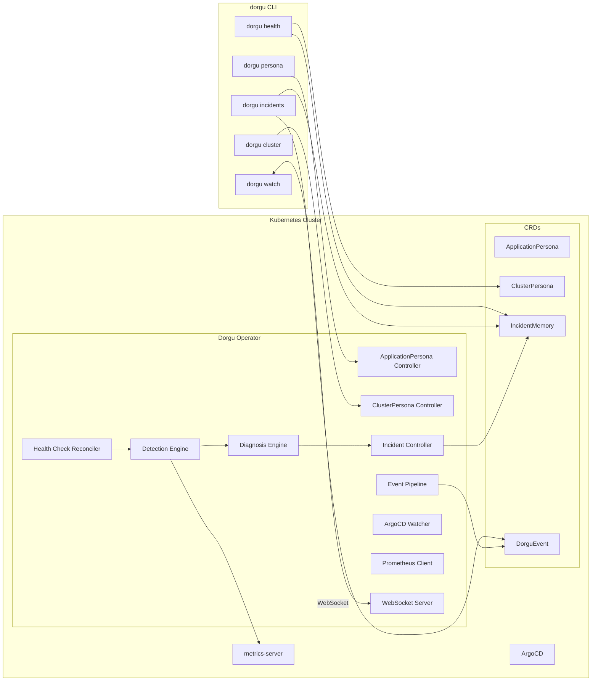

# Dorgu Operator

Cluster-side component of [Dorgu](https://github.com/dorgu-ai/dorgu): validates Deployments against **ApplicationPersona** CRDs, manages **ClusterPersona** for cluster identity, **detects cluster health issues**, **diagnoses root causes**, and **tracks incidents** — all without modifying your workloads. Integrates with ArgoCD, Prometheus, metrics-server, and the CLI.

[](https://go.dev/)
[](LICENSE)

**Features:** Health detection (node failures, pod crashes, resource saturation, control plane) · Deterministic diagnosis with confidence scoring · Incident tracking via IncidentMemory CRDs · ApplicationPersona validation · ClusterPersona discovery · ArgoCD sync/health · Prometheus baseline learning · WebSocket server · Optional validating webhook

**CLI integration:**
```bash
# Cluster health at a glance
dorgu health

# View active incidents
dorgu incidents list
dorgu incidents describe im-default-api-oom-a3f2

# Generate and apply a persona
dorgu persona apply ./my-app --namespace production

# Watch real-time updates
dorgu watch personas
```

## CRDs

| CRD | Scope | Purpose |
|-----|-------|---------|
| **ApplicationPersona** | Namespaced | App identity and requirements: resources, scaling, health probes, security, ownership. Status includes validation, health, and active incident count. |
| **ClusterPersona** | Cluster | Cluster identity and state: nodes, add-ons, capacity, self-healing policy (mode, trust level, rollback config). |
| **IncidentMemory** | Namespaced | Detected incidents: signal, root cause, confidence score, affected resources, resolution tracking. Correlates to Personas. |
| **RemediationAction** | Namespaced | Remediation proposals: YAML diff, approval workflow, rollback spec, trust level requirements. (Execution in Phase 2b.) |
| **DorguEvent** | Namespaced | Classified cluster events with severity, category, persona correlation, and TTL-based cleanup. |

## Getting Started

### Prerequisites

Go 1.21+ (for building), Helm 3.x, kubectl, and a Kubernetes cluster (1.11+).

### Install with Helm (Recommended)

```bash
# Install the operator
helm install dorgu-operator oci://ghcr.io/dorgu-ai/dorgu-operator-charts/dorgu-operator \
  --version 0.4.0 \
  --namespace dorgu-system \
  --create-namespace
```

**With health detection enabled (recommended):**

```bash
helm install dorgu-operator oci://ghcr.io/dorgu-ai/dorgu-operator-charts/dorgu-operator \
  --version 0.4.0 \
  --namespace dorgu-system \
  --create-namespace \
  --set healthCheck.enabled=true \
  --set websocket.enabled=true
```

**With all optional features:**

```bash
helm install dorgu-operator oci://ghcr.io/dorgu-ai/dorgu-operator-charts/dorgu-operator \
  --version 0.4.0 \
  --namespace dorgu-system \
  --create-namespace \
  --set healthCheck.enabled=true \
  --set healthCheck.metricsServer=true \
  --set webhook.enabled=true \
  --set webhook.mode=advisory \
  --set prometheus.enabled=true \
  --set prometheus.url=http://prometheus-server.monitoring:9090 \
  --set websocket.enabled=true
```

**Public installs:** Image and Helm chart are published to GHCR on release. Set package visibility to **Public** in GitHub (package settings) so `helm install oci://...` works without login.

### Configuration Options

| Parameter | Description | Default |
|-----------|-------------|---------|
| `healthCheck.enabled` | Enable health detection, diagnosis, and incident tracking | `false` |
| `healthCheck.interval` | Health check reconciliation interval | `60s` |
| `healthCheck.metricsServer` | Enable metrics-server integration for usage-based detection | `true` |
| `webhook.enabled` | Enable deployment validation webhook | `false` |
| `webhook.mode` | Webhook mode: `advisory` or `enforcing` | `advisory` |
| `argocd.enabled` | Enable ArgoCD Application watching | `true` |
| `prometheus.enabled` | Enable Prometheus metrics integration | `false` |
| `prometheus.url` | Prometheus server URL | `""` |
| `websocket.enabled` | Enable WebSocket server for CLI | `false` |
| `websocket.port` | WebSocket server port | `9090` |

### Deploy from Source

**Build and push your image:**

```sh
make docker-build docker-push IMG=<some-registry>/dorgu-operator:tag
```

**Install the CRDs:**

```sh
make install
```

**Deploy the Manager:**

```sh
make deploy IMG=<some-registry>/dorgu-operator:tag
```

**Create sample resources:**

```sh
kubectl apply -k config/samples/
```

### Uninstall

```sh
# Delete sample resources
kubectl delete -k config/samples/

# Delete CRDs
make uninstall

# Undeploy controller
make undeploy

# Or with Helm
helm uninstall dorgu-operator -n dorgu-system
```

## Architecture



## Contributing & Security

[CONTRIBUTING.md](CONTRIBUTING.md) — operator-specific steps and link to [CLI contributing guidelines](https://github.com/dorgu-ai/dorgu/blob/main/CONTRIBUTING.md).  
[SECURITY.md](SECURITY.md) — how to report vulnerabilities.

**License:** Apache 2.0 — [LICENSE](LICENSE).
