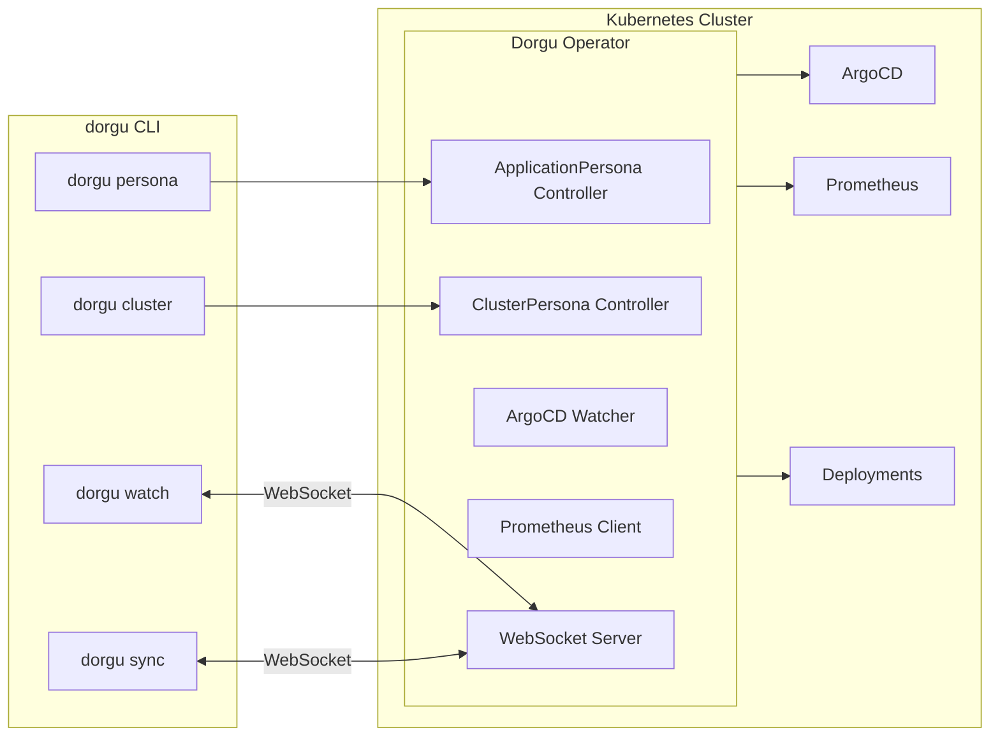

# Dorgu Operator

Cluster-side component of [Dorgu](https://github.com/dorgu-ai/dorgu): validates Deployments against **ApplicationPersona** CRDs, manages **ClusterPersona** for cluster identity, and integrates with ArgoCD, Prometheus, and the CLI. Read-only on workloads — it validates and reports; it does not modify your Deployments or Pods.

[](https://go.dev/)
[](LICENSE)

**Features:** ApplicationPersona validation (resources, replicas, health, security) · ClusterPersona discovery (nodes, add-ons, capacity) · ArgoCD sync/health status · Prometheus baseline learning · WebSocket server for `dorgu watch` / `dorgu sync` · Optional validating webhook (advisory or enforcing)

**CLI integration:**
```bash
# Generate and apply a persona from your application
dorgu persona apply ./my-app --namespace production

# Check persona status
dorgu persona status my-app -n production

# Initialize cluster persona
dorgu cluster init --name production-cluster --environment production

# Watch real-time updates
dorgu watch personas

# Sync with operator
dorgu sync status
```

## CRDs

| CRD | Purpose |
|-----|---------|
| **ApplicationPersona** | App identity and requirements: resources, scaling, health probes, security, ownership. |
| **ClusterPersona** | Cluster identity and state: nodes, add-ons (ArgoCD, Prometheus, cert-manager), capacity, namespace summary. |

## Getting Started

### Prerequisites

Go 1.21+ (for building), Helm 3.x, kubectl, and a Kubernetes cluster (1.11+).

### Install with Helm (Recommended)

```bash
# Install the operator
helm install dorgu-operator oci://ghcr.io/dorgu-ai/dorgu-operator-charts/dorgu-operator \
  --version 0.2.0 \
  --namespace dorgu-system \
  --create-namespace
```

**With optional features enabled:**

```bash
helm install dorgu-operator oci://ghcr.io/dorgu-ai/dorgu-operator-charts/dorgu-operator \
  --version 0.2.0 \
  --namespace dorgu-system \
  --create-namespace \
  --set webhook.enabled=true \
  --set webhook.mode=advisory \
  --set prometheus.enabled=true \
  --set prometheus.url=http://prometheus-server.monitoring:9090 \
  --set websocket.enabled=true
```

**Public installs:** Image and Helm chart are published to GHCR on release. Set package visibility to **Public** in GitHub (package settings) so `helm install oci://...` works without login.

### Configuration Options

| Parameter | Description | Default |
|-----------|-------------|---------|
| `webhook.enabled` | Enable deployment validation webhook | `false` |
| `webhook.mode` | Webhook mode: `advisory` or `enforcing` | `advisory` |
| `argocd.enabled` | Enable ArgoCD Application watching | `true` |
| `prometheus.enabled` | Enable Prometheus metrics integration | `false` |
| `prometheus.url` | Prometheus server URL | `""` |
| `websocket.enabled` | Enable WebSocket server for CLI | `false` |
| `websocket.port` | WebSocket server port | `9090` |

### Deploy from Source

**Build and push your image:**

```sh
make docker-build docker-push IMG=<some-registry>/dorgu-operator:tag
```

**Install the CRDs:**

```sh
make install
```

**Deploy the Manager:**

```sh
make deploy IMG=<some-registry>/dorgu-operator:tag
```

**Create sample resources:**

```sh
kubectl apply -k config/samples/
```

### Uninstall

```sh
# Delete sample resources
kubectl delete -k config/samples/

# Delete CRDs
make uninstall

# Undeploy controller
make undeploy

# Or with Helm
helm uninstall dorgu-operator -n dorgu-system
```

## Architecture



## Contributing & Security

[CONTRIBUTING.md](CONTRIBUTING.md) — operator-specific steps and link to [CLI contributing guidelines](https://github.com/dorgu-ai/dorgu/blob/main/CONTRIBUTING.md).  
[SECURITY.md](SECURITY.md) — how to report vulnerabilities.

**License:** Apache 2.0 — [LICENSE](LICENSE).
